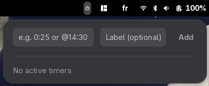
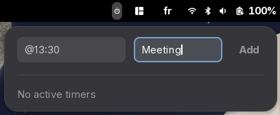
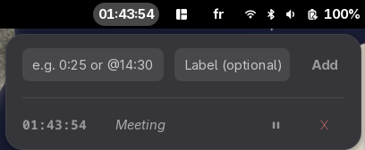
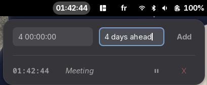
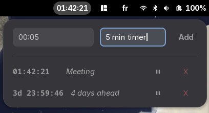

# Countdown Timers

A GNOME Shell extension that lets you run multiple countdown timers directly from the top panel bar.


---

## Features

- **Multiple simultaneous timers** — add as many countdowns as you need, each with an optional name
- **Two input formats** — count down for a duration, or count down to a specific time of day
- **Persistent across lock/logout** — timers are stored as epoch timestamps, so they keep running while your screen is locked
- **Alarm sound** — plays a sound when a timer expires; supports a custom audio file or falls back to the system default
- **Panel display modes** — show only the nearest timer, or show all running timers side-by-side in the top bar
- **Per-timer controls** — pause, resume, and delete each timer independently








---

## Input formats

| What you type | What it does |
|---|---|
| `0:25` | Count down 25 minutes |
| `1:30:00` | Count down 1 hour 30 minutes |
| `1 2:30:00` | Count down 1 day, 2 hours, 30 minutes |
| `@14:30` | Count down to 14:30 today (wraps to tomorrow if already past) |
| `@08:00:00` | Count down to 08:00:00 today |

---

## Installation

### Manual (from source)

```bash
git clone https://github.com/StefanHellings/countdown-timers.git
cd countdown-timers
chmod +x install.sh
./install.sh
```

Then restart GNOME Shell:

- **Wayland:** log out and log back in
- **X11:** press `Alt+F2`, type `r`, press `Enter`

The install script copies the extension files, compiles the GSettings schema, and enables the extension automatically.

---

## Settings

Open **Extensions** (or GNOME Tweaks → Extensions) and click the gear icon next to Countdown Timers, or run:

```bash
gnome-extensions prefs countdown-timers@stefanhellings.github.com
```

### Panel display

| Setting | Description |
|---|---|
| Show all countdowns in panel | When on, every running timer appears in the top bar side-by-side, separated by `·`. When off (default), only the nearest timer is shown. |

### Alarm sound

| Setting | Description |
|---|---|
| Custom alarm sound | Choose any audio file (MP3, OGG, WAV, FLAC, AAC). Click **Clear** to revert to the system default. |

---

## Notes

- Tested on
  - Fedora Linux 43 (Workstation Edition) with GNOME 49.5
  - Fedora Linux 44 (Workstation Edition) with GNOME 50
- Included some soundfiles I downloaded from pixabay.com
